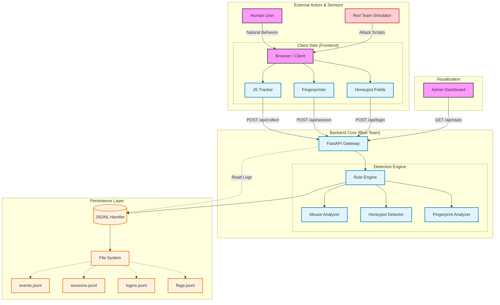

# 🛡️ Bot Detector Lab - Behavioral Analytics & Anti-Abuse System


> **A full-stack cybersecurity laboratory designed to detect automated threats using behavioral biometrics, fingerprinting, and honey-traps.**

## Table of Contents
- [Overview](#overview)
- [Key Features](#key-features)
- [System Architecture](#system-architecture)
- [Installation](#installation)
- [Usage & Testing](#usage--testing)
- [Project Structure](#project-structure)
- [API Documentation](#API-Documentation)
- [Future Roadmap](#future-roadmap)
- [Disclaimer](#disclaimer)

---

## Overview

**Bot Detector Lab** is a research-oriented security framework built to distinguish between human users and automated scripts (bots). Unlike traditional CAPTCHAs that disrupt user experience, this system operates passively by analyzing **telemetry data** (mouse movements, keystroke dynamics, and timing).

This project bridges the gap between **Cybersecurity** and **Data Science**, collecting high-fidelity behavioral logs in `JSONL` format, ready for training Machine Learning models.

### Why this project?
- To study how bots interact differently from humans.
- To implement "Defense in Depth" using Honey-traps and Fingerprinting.
- To provide a dataset for **Knowledge Engineering** applications in security.

## Key Features

### The Brain (Backend Detection Engine)
- **Velocity Analysis:** Detects "teleporting" mouse cursors (common in Selenium scripts).
- **Linearity Check:** Identifies perfect straight-line movements (non-human behavior).
- **Time-to-Submit:** Flags superhuman form submission speeds (< 2000ms).
- **Click-Map Validation:** Detects clicks that occur without preceding mouse movement.

### 🕸️ The Trap (Frontend Sensors)
- **Advanced Telemetry:** Captures `mousemove` (velocity, acceleration), `keydown` (flight time), and `scroll` events at 60Hz.
- **Multi-Layer Honeypots:**
  - `Display: none` fields
  - Off-screen inputs (Coordinates: -9999px)
  - Zero-width/height elements
  - Invisible links (`opacity: 0`)
  - Time-based hidden tokens

### Data Engineering & Viz
- **High-Performance Logging:** Uses `aiofiles` and `JSON Lines` (.jsonl) for append-only, non-blocking storage.
- **Real-time Dashboard:** Live visualization of Human vs. Bot traffic and detection flags.
- **Fingerprinting:** Collects Canvas Hash, User-Agent, and Screen Resolution for device identification.

## System Architecture

The system operates on a **Sensor-Controller-Storage** architecture. It is designed to simulate a "Red Team vs. Blue Team" environment where attack scripts feed data into the detection engine.



## Detection Algorithms

The system employs a multi-layered approach to identify non-human behavior. Each detector contributes a **Confidence Score** to the final decision.

| Component | Detection Logic | Confidence Score |
|-----------|-----------------|------------------|
| **Honeypot** | **Hidden Fields:** Detects interaction with fields hidden via CSS (`opacity:0`, `display:none`). Humans cannot see these; bots fill them blindly. | **1.0 (Certain)** |
| **Mouse Analysis** | **Perfect Line:** Variance < 5°. Bots often move in mathematically perfect straight lines.<br>**Teleporting:** Velocity = 0. Cursor jumps instantly between points.<br>**Impossible Speed:** Movement > 3000px in < 100ms. | **0.85 - 0.95** |
| **Timing** | **Superhuman Speed:** Form submission < 2000ms. Real users need time to read and type. | **0.8 - 1.0** |
| **Fingerprint** | **Bot User-Agents:** HeadlessChrome, Selenium, PhantomJS.<br>**Hardware:** Impossible configurations (e.g., 0 CPU cores). | **0.7 - 0.95** |
| **Anomalies** | **Click No Move:** Clicking without preceding mouse events (common in script-based attacks). | **0.9** |

## Installation

### Prerequisites
* Python 3.9+
* pip (Python Package Manager)

### Quick Start

1.  **Clone the repository**

    ```bash
    git clone https://github.com/kiyoneshin/bot-detector-lab.git
    cd bot-detector-lab
    ```

2.  **Install Dependencies**
    It is recommended to use a virtual environment.

    ```bash
    python -m venv venv

    # Windows PowerShell
    .\venv\Scripts\activate

    # Command Prompt (CMD)
    .\venv\Scripts\activate.bat

    # Linux/Mac
    source venv/bin/activate

    pip install -r requirements.txt
    ```

3.  **Run the Server**

    ```bash
    python app.py
    # Server will start at http://localhost:8000
    ```

---

## Usage & Testing

### Blue Team (Monitoring)
1.  Navigate to `http://localhost:8000/dashboard`.
2.  Observe the **Real-time Stats** panel.
3.  Watch the "**Recent Detections**" log for flagged sessions.

### Red Team (Simulation)

**Option 1: Automated Attack Suite (Recommended)**
Use the built-in Python CLI tool to launch automated Selenium bots.

1.  Open a new terminal.
2.  Run the simulation controller:
    ```bash
    python -m simulations.main
    ```
3.  Select an attack scenario from the menu:
    * `1`: Linear Bot (Tests angle variance logic)
    * `2`: Speed Bot (Tests timing logic)
    * `3`: Honeypot Bot (Tests hidden fields)
    * `4`: BOT Combo Bot (Tests multiple attack vectors)
    * `6`: Run All Scenarios
    * `7`: Stress Test (Randomizes attacks)

**Option 2: Manual Testing (Browser Console)**
1.  Open the Login Page (`http://localhost:8000`).
2.  Open Developer Tools (F12) -> Console.
3.  Run this script to trigger the honeypot trap:
    ```javascript
    document.getElementById('website').value = 'I am a bot';
    document.getElementById('loginForm').requestSubmit();
    ```

---

## Project Structure

```plaintext
bot-detector-lab/
│
├── app.py                          # Main FastAPI application
├── requirements.txt                # Python dependencies
├── config.py                       # Configuration settings
├── README.md                       # Project documentation
│
├── models/                         # Data models and schemas
│   ├── __init__.py
│   ├── events.py                   # Pydantic models for events
│   └── session.py                  # Session data models
│
├── detectors/                      # Detection algorithm modules
│   ├── __init__.py
│   ├── rule_engine.py              # Rule-based detection logic
│   ├── mouse_analyzer.py           # Mouse movement analysis
│   ├── honeypot_detector.py        # Honeypot interaction detection
│   └── fingerprint_analyzer.py     # Device fingerprint analysis
│
├── storage/                        # Data storage handlers
│   ├── __init__.py
│   ├── jsonl_handler.py            # Async JSONL file operations
│   └── sqlite_handler.py           # (Optional) SQLite operations
│
├── utils/                          # Utility functions
│   ├── __init__.py
│   ├── validators.py               # Input validation helpers
│   └── analytics.py                # Statistical & math helpers
│
├── static/                         # Frontend static files
│   ├── css/
│   │   └── style.css               # Main stylesheet
│   ├── js/
│   │   ├── tracker.js              # Behavioral tracking engine
│   │   ├── fingerprint.js          # Browser fingerprinting script
│   │   └── dashboard.js            # Real-time dashboard logic
│   └── img/
│       └── logo.png                # Project assets
│
├── templates/                      # HTML templates
│   ├── index.html                  # Login page with honeypots
│   ├── dashboard.html              # Analytics dashboard view
│   └── test_page.html              # Additional test scenarios
│
├── data/                           # Data storage directory
│   ├── events.jsonl                # Raw behavioral events log
│   ├── sessions.jsonl              # Session metadata log
│   ├── flags.jsonl                 # Detection flags log
│   └── bot_detector.db             # (Optional) SQLite database
│
├── tests/                          # Test suite
│   ├── __init__.py
│   ├── test_detectors.py           # Unit tests for detectors
│   ├── test_storage.py             # Unit tests for storage
│   └── test_api.py                 # Integration tests for API
│
├── simulations/                    # Red Team simulation tools
│   ├── __init__.py                 # Package initialization
│   ├── config.py                   # Simulation settings & constants
│   ├── main.py                     # CLI entry point & menu
│   ├── base.py                     # Base class & WebDriver setup
│   └── scenarios/                  # Specific attack scripts
│       ├── __init__.py             # Scenarios package exports
│       ├── linear_bot.py           # Straight line movement attack
│       ├── speed_bot.py            # Instant form submission attack
│       ├── honeypot_bot.py         # Hidden field interaction attack
│       ├── combo_bot.py            # Multi-vector attack combination
│       └── human_simulator.py      # Realistic human behavior test
│
└── notebooks/                      # Data analysis tools
    ├── exploration.ipynb           # Data exploration & plotting
    └── ml_models.ipynb             # ML model experiments
```

---

## API Documentation

Since this project is built with **FastAPI**, fully interactive API documentation (Swagger UI) is automatically generated.

👉 **Access full documentation here:** [http://localhost:8000/docs](http://localhost:8000/docs) (When server is running)

### Key Endpoints Overview

| Method | Endpoint | Description |
| :--- | :--- | :--- |
| `POST` | **/api/collect** | Ingest behavioral event batches (mouse, click, scroll) from the frontend tracker. |
| `POST` | **/api/session** | Initialize a new user session and store device fingerprint data. |
| `POST` | **/api/login** | Submit credentials. The **Detection Engine** runs synchronously and returns `200` (Human) or `403` (Bot). |
| `GET` | **/api/stats** | Retrieve aggregated real-time statistics for the Dashboard. |
| `GET` | **/api/logs** | Fetch recent login logs with detailed detection reasoning. |

---

## Future Roadmap

- [ ] **Machine Learning Integration:** Train a Random Forest model on the collected `events.jsonl` data to replace static rules.
- [ ] **IP Reputation:** Integrate with external Threat Intelligence APIs.
- [ ] **Docker Support:** Containerize the application for easy deployment.
- [ ] **Replay System:** Visualize user sessions by replaying mouse coordinates on a canvas.

---

## Disclaimer

This project is for **Educational and Research Purposes Only**.
The techniques demonstrated here are for learning how to defend web applications. Do not use the bot simulation scripts against websites you do not own or have explicit permission to test.

## License

Distributed under the MIT License. See `LICENSE` for more information.

---
Made by kiyoneshin